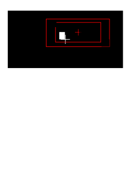

# Template repository for matlab analysis project

This script runs a simple routine that will display a red square on the screen
that the user can move and rescale till it feels their whole field of view (FOV)
on the screen. This can prove useful when the FOV is partly obstructed (like in
an fMRI) experiment and hard to measure.



## Content

```bash
├── .git
├── .github  # where you put anything github related
│   └── workflows # where you define your github actions
├── lib # where you put the code from external libraries
├── src # where you put your code
├── tests # where you put your unit tests
|   ├── README.md
|   └── miss_hit.cfg
├── LICENSE
├── README.md
├── miss_hit.cfg # configuration file for the matlab miss hit linter
└── initEnv.m # a .m file to set up your project (adds the right folder to the path)
```

## How to install and run

Install

```
git clone --recurse-submodules https://github.com/cpp-lln-lab/estimate_visual_FOV.git
```

Set parameters in `setParameters.m`

Run

```
mainScript
```

## Experimenter control

When run in `cfg.userIsExperimenter = true` mode, the experimenter can use the
keys

- `LeftArrow` to move the FOV left
- `RightArrow` to move the FOV right move the FOV
- `UpArrow` to move the FOV up
- `DownArrow` to move the FOV down
- `p` to scale the FOV up
- `m` to scale the FOV down

Otherwise check the `cfg.keyboard` set up in `setParameters`.
## IMPORTANT

Make sure that the values you use in this script are the same as the one you
will use in the experiment where you need to adapt the FOV.

```matlab
    cfg.screen.monitorWidth = FIXME % in cm
    cfg.screen.monitorDistance = FIXME; % distance from the screen in cm
```


## Output example

```matlab
--------------------------------------------------------------------------------
Field of view in PIXEL:
 top left: 1137 219
 bottom right: 1595 477

Field of view in PIXEL:
 width: 258
 height: 458


--------------------------------------------------------------------------------
Field of view in DEGREES OF VISUAL ANGLES:
 top left: 8.32304 1.60312
 bottom right: 11.6757 3.49172

Field of view in DEGREES OF VISUAL ANGLES:
 width: 1.8886
 height: 3.35264


--------------------------------------------------------------------------------
SET UP TO COPY

% fixation cross displacement in degrees of visual angles:

 cfg.fixation.xDisplacement = 1.771482;
 cfg.fixation.yDisplacement = -0.936982;

% set up configuration:

 cfg.testingDevice = 'mri';
 cfg.screen.monitorDistance = 95.000000;
 cfg.screen.monitorWidth = 25.000000;
```
